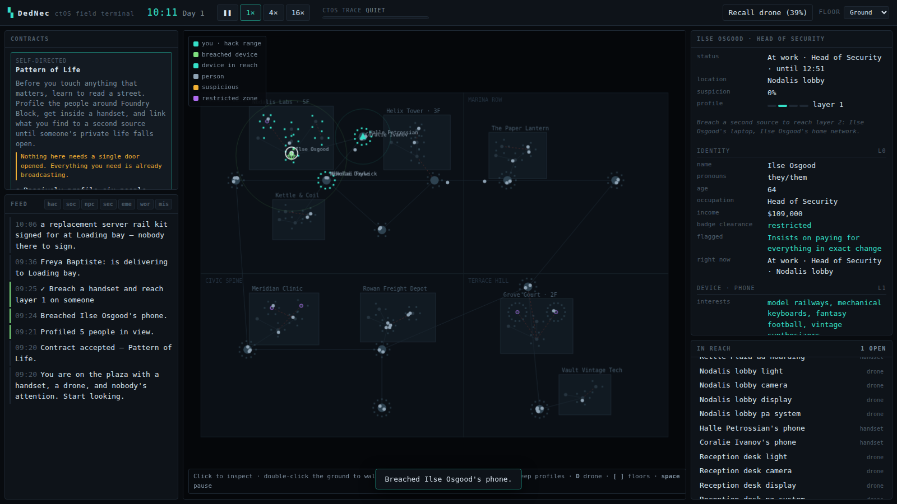

# DedSec

[](https://github.com/AES256Afro/DedSec/actions/workflows/ci.yml)

A city you walk around at night while ctOS reads everybody in it. No combat, no
fail state, no timer. Profile cards pop over people as you pass them, most of
them are just texture, and some of them are not.

Two clients, one simulation:

- **the street** — first person, 3D, the ctOS overlay and the casual loop. This
  is the front door.
- **the field terminal** — the same city top-down with every instrument switched
  on: contracts, the verb list, the trace meter, the network view.



## Run it

```bash
npm install
npm test           # 91 tests over the simulation core
npm run serve      # then open http://localhost:5173/ (street)
                   #      or http://localhost:5173/web/terminal.html
npm run sim        # headless: watch the city run with no player in it
npm run build:site # static bundle in site/ — any host will serve it
```

Add `?seed=marina` to the URL for a different city. Same seed, same city, same
tangle of secrets, every time — which is also the whole save system, since world
state lives in the tab and is regenerated from the seed.

Deployment (GitHub Pages, custom domain, DNS): [`docs/hosting.md`](docs/hosting.md).

## The street

**Walk → a card pops → do something about it, or do not.**

Everyone within ctOS range gets a layer-0 card without your asking: name, job,
income, one flagged quirk. That is the premise of the fantasy taken literally,
and it is why the profiler reads handsets rather than faces — two-thirds of a
city is indoors during office hours, and a street where you can only profile
what you can see is a street with nobody on it. People behind a wall get a
dashed card; people you can actually see get a solid one.

Some cards carry a flag, and flags come in pairs:

- 🔴 **flagged** — this person is doing something to someone;
- 🟡 **at risk** — this person is the one it is being done to.

The pairing is the design. A lone bad person is a label; a bad person attached
to somebody they are hurting is a situation. Read either party's phone and the
case opens: what it actually is, who is on the other end, and three or four
small things you could do — settle the arrears, route the ledger to the
licensing board, forward the tenancy clause, or keep walking. Every one of them
works. There is nothing to fail.

Progress is a ledger, not a score: **7 helped · 2 exposed · 61 profiled**. No
denominator, no completion percentage, nothing to clear.

Cases are read out of the city rather than sprinkled on it. Every one needs a
configuration the population generator already produced — somebody with a
gambling secret, a manager who already has a report, an org with somebody
skimming it — and the predatory relationship is written into the actual social
graph, so the dossier lists it and every existing verb can act on it.

## The deeper loop

**Observe → Profile → Manipulate → Infiltrate.**

1. **Observe.** ctOS names everyone in range. Cameras and the drone extend that
   to places you cannot stand.
2. **Profile.** Four layers, each earned rather than bought:
   - **L0** name, job, income, and one flagged quirk — free, from sight alone.
   - **L1** their handset: contacts, calendar, interests, pattern of life.
   - **L2** the handset **plus an independent second source** — their home
     network, their employer's records, the clinic. This is the layer that pays.
   - **L3** corroboration across a *second person's* data. Career-ending
     material.
3. **Manipulate.** Every secret carries concrete `hooks`: hack verbs that do not
   exist until you have surfaced the fact behind them. Learning that the
   security chief has a shellfish allergy is what *creates the button* that
   amends his lunch order. No fact, no button.
4. **Infiltrate.** Walk through the gap you made.

## What makes it a game rather than a menu

**Profiling literally generates the verb list.** `verbsForNpc` returns the
universal plays plus one entry per hook on every *revealed* secret. An
unprofiled person exposes no leverage verbs at all. The depth of your dossier is
the size of your move set — that relationship is enforced in code, not implied
by fiction.

**People can see through you.** An impulse is not a command; it is a claim
delivered through a channel the target trusts to some degree. They weigh it
against the personality trait it targets, whether it is plausible *at this hour*,
and what abandoning their current task would cost them. Three outcomes: they
comply, they hesitate and go and check, or they see through it — gain suspicion,
remember it, and tell their colleagues.

**The odds are on the button, before you spend them.** Every fallible play shows
what it will actually score and why:

```
Fabricate an app alert                            1.0m · trace +5%
acts 60% · checks first 22% · sees through it 18%
+ leans on something they actually care about · + middling curiosity (0.63)
· − follows procedure, will check
```

Both that readout and the live roll go through the same `scoreImpulse`, so they
cannot drift — there is a test pinning them to within a float. Manipulation is a
read of a person, not a coin flip you only understand afterwards.

Traits are not all shields. `diligence` and `techLiteracy` make someone harder to
move; `curiosity`, `greed`, `vanity`, `gullibility` and `anxiety` make them
*easier* — a bait file works better on a curious person, not worse. Which is
which lives in `TRAIT_POLARITY`.

**Physical facts cannot be disbelieved.** A forged text is a claim. A room driven
to forty degrees is not. Environmental verbs bypass adjudication entirely and
always land; social verbs are quiet and fallible. That is the central trade:
**reliability costs trace.**

**The building does the work.** The strongest plays never touch anything. Raise a
transfer order and the lab's own robotic arm carries the prototype out of its
weight-sensing case to a public bench, and the logs show a valid user following
an approved procedure. Amend a food order in flight and the kitchen makes what
the ticket says.

**Three separate pressures, deliberately not merged:**

| | behaviour | what it does |
|---|---|---|
| **trace** | live, decays when you go quiet | ctOS noticing *now*; saturate it and the city hunts you, badges get re-keyed, breached nodes get audited back |
| **suspicion** | per person, sticky for hours | someone who did not believe you stays unconvinced and spreads it by conversation |
| **evidence** | permanent, invisible in-world | what an investigator could reconstruct afterwards — the entire basis of the ghost score |

You can win loud. You cannot win loud *and* clean.

## Missions are predicates, not scripts

An objective is a question asked of world state every tick — "is the chip in the
player's hands", "does the prototype lab contain no staff" — never a sequence you
are expected to walk. `test/heist.test.ts` plays the flagship contract end to
end: profile two staff, clone a lab tech's badge off their own phone, empty the
lab (socially first, escalating to the climate system for whoever will not
budge), raise a transfer order, collect the chip from where the building put it,
walk out. Nothing in that route is hard-coded; the objectives just became true.

Accolades are graded separately at completion, which is where the pressure to be
*clean* rather than merely successful lives.

## The city

Four districts, eight buildings, a hand-authored layout with procedural interiors
and a fully generated population of ~90 people with interlocking lives — staff
rosters, households, affairs and debts that reach across organisations, and daily
routines derived from the job rather than sprinkled on afterwards.

The ctOS device layer is *shaped like the building*. Devices sit in rooms, rooms
sit behind doors, and the gateway that exposes a subnet is always in the most
protected room the building has. You can touch a node if it is in handset range,
in drone range, in range of a routing node you already hold, or on a subnet whose
gateway you have breached. Chain-hacking through a courier's pocket into a subnet
you have no physical access to is the intended play, not an exploit.

The city runs whether or not you are there. Lunch gets ordered because someone is
hungry at their usual time; the ambulance comes because someone collapsed. Run
`npm run sim` and watch it do that with no player in it — a day of untouched city
scores 100/100 on the forensic baseline, which is what makes your own smudges
legible.

## Layout

```
src/
  core/      seeded rng, world clock, event log
  world/     place graph + A*, city blueprint, ctOS network generation
  npc/       archetypes, traits, secrets→leverage, social graph, routines, behaviour
  profile/   layered dossier reveal and evidence linking
  hack/      network reach, breaching, the verb registry, trace/suspicion/forensics
  sim/       game state, player actions, dispatch, the tick
  mission/   objective runtime and the contract board
  case/      the casual loop: paired harm/need cases and the ledger
  cli/       headless runner
web/
  three/     the street client — city extrusion, walking, crowd, ctOS cards
  render/    the field terminal's canvas map
  ui/        the field terminal's panels
test/        91 tests, including full scripted playthroughs of every contract
```

One runtime dependency: three.js, loaded through an import map and vendored into
the build. Everything else is TypeScript compiled with `tsc` straight to ES
modules the browser loads directly — no bundler, no framework, no build server.

### Controls — the street

**W A S D** walk · **shift** jog · mouse look · **E** stop and look properly ·
**F** read the nearest device they own · **Esc** step back out · **H** hints.

### Controls — the field terminal

Click to inspect · double-click the ground to walk · drag to pan · scroll to zoom
· **S** sweep profiles · **D** drone · **[** **]** floors · **space** pause.

Selecting a place pins it as the destination for any play that moves someone. A
lure with no destination only makes the target stop and stare.

## Design notes

Longer write-up of the systems and the reasoning behind them:
[`docs/design.md`](docs/design.md).

## Not built yet

The scope here is the simulation and the sandbox, not a shipped product. Missing:
save/load, audio, a skill tree beyond the single `deep_crawler` stub, controller
input, and a mobile layout. The street client is outdoors only — buildings are
solid, and going inside is still the field terminal's job. The four contracts on the board are a vertical slice —
`src/mission/missions/index.ts` is where more go, and the objective format means
they are written as world-state predicates rather than scripted beats.
